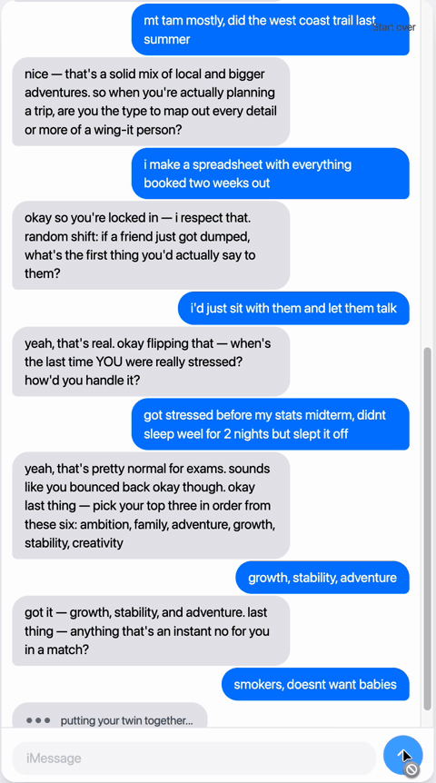

# Twin

> An onboarding agent that creates your digital double for Ditto's matchmaking engine.

<!-- Record a GIF of the persona reveal moment and save to docs/reveal.gif to enable: -->
<!--  -->

## What it does

Twin is a conversational AI that interviews a new user over ~9 iMessage-style turns and produces a **structured persona** downstream matching will consume. Under the hood, Twin probes behavioral questions that score against Big-Five-adjacent dimensions (extraversion, intuition, thinking, judging) and returns both an MBTI label (the culture signal users will share) and continuous dimension scores (the rigorous downstream signal). The persona also includes ranked values, dealbreakers, an interests graph with depth signals, and three specific conversation hooks a matched partner could open with.

## Why this feature first

Ditto's thesis is *"your AI persona dates 1000 times in simulation before humans meet."* That stack has three infrastructure layers: (1) the persona, (2) the simulator, (3) the human-facing date proposer. Without layer 1, the other two are inert. Twin is the feature that creates layer 1 — it's the one layer that's demonstrable with a single user (the simulator needs 2+ personas; the date proposer needs a match graph), and it's upstream of everything else Ditto will build.

See [docs/research.md](docs/research.md) for the full argument.

## Run locally

Backend (one shell):

```bash
cd backend
python3.12 -m venv .venv   # or python3.11
source .venv/bin/activate
pip install -r requirements.txt
cp .env.example .env       # add your ANTHROPIC_API_KEY
uvicorn app.main:app --reload
```

Frontend (another shell):

```bash
cd frontend
npm install
npm run dev
```

Then open `http://localhost:5173`.

## Architecture

The agent is a LangGraph state machine. 10 nodes, one conditional edge. Sequence: `greeting → collect_demographics → probe_weekend → [adaptive_interest?] → probe_planning → probe_support → values_rank → ask_dealbreakers → synthesize → reveal`.

See [docs/state-machine.md](docs/state-machine.md) for the generated mermaid diagram.

Key architectural choices:

- **Merged structured-output call per probe.** Each probe node makes one Claude call that returns scores + next-question in a single structured output. Halves per-turn latency vs. the naïve two-call design.
- **Haiku 4.5 for probes, Opus 4.7 for synthesis.** Fastest model where the user is waiting (per-turn ~500-800ms), smartest where they aren't (synthesis ~10-15s hidden behind typing indicator).
- **`Channel` abstraction.** `WebChannel` buffers outbound messages for the HTTP response; `PhotonChannel` is stubbed as a pointer at Ditto's real iMessage delivery path. Nodes don't know which channel they're delivering through.

See [docs/decisions.md](docs/decisions.md) for the full decision log.

## What's next (V2)

### Humor-based compatibility (next axis)

Shared sense of humor is one of the more robust predictors of long-term relationship satisfaction (Gottman's marriage-stability research; Hall 2017 meta-analysis on humor in romance). Stronger than shared hobbies or demographic similarity, and harder to fake — you can lie about valuing family, you can't fake what makes you laugh. No major dating app matches on a rigorous humor signal today.

**How it plugs into Twin:** after the interview, the user reacts to a curated stimulus set (20–30 items spanning dry / absurdist / wholesome / dark / observational / meme-native). Reactions embed into a humor vector that attaches to the persona and feeds Ditto's matcher alongside personality + values + interests. Additive, not a replacement.

### Simulation engine

Two LLM agents with different personas run a simulated first date; a judge agent scores chemistry. The "1000 simulated dates" thesis made literal. Twin's persona schema consumes as-is.

### Post-date feedback agent

After a real date, Twin texts the user to extract qualitative feedback, updates the persona, retrains the simulator's judge. Twin graduates from one-shot onboarding into a lifecycle agent.

Ordering logic: humor (differentiation with research base) → simulator (cheap once Twin exists, unblocks Ditto's marketing claim) → feedback agent (requires real dates + time).

## Repo layout

Full design and implementation are documented in:

- [docs/superpowers/specs/2026-04-22-twin-design.md](docs/superpowers/specs/2026-04-22-twin-design.md) — design spec
- [docs/superpowers/plans/2026-04-23-twin-implementation.md](docs/superpowers/plans/2026-04-23-twin-implementation.md) — 42-task implementation plan
- [docs/research.md](docs/research.md) — founder memo with citations
- [docs/decisions.md](docs/decisions.md) — ADR-lite log

## Out of scope (named, not built)

No authentication, no mobile responsive, no tests beyond MBTI unit tests + e2e smoke test, no real Photon SDK integration, no error handling beyond alerts, no deploy pipeline (Vercel/Railway configs available but opt-in). See the design spec's "Out of scope" section for the full list.
