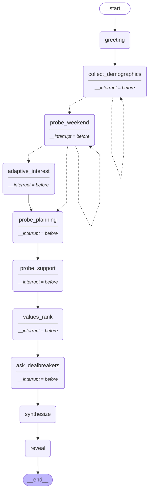

# Twin agent state machine

Generated by `backend/scripts/export_graph.py`.

```mermaid
%%{init: {'flowchart': {'curve': 'linear'}}}%%
graph TD;
	__start__([<p>__start__</p>]):::first
	greeting(greeting)
	collect_demographics(collect_demographics<hr/><small><em>__interrupt = before</em></small>)
	probe_weekend(probe_weekend<hr/><small><em>__interrupt = before</em></small>)
	adaptive_interest(adaptive_interest<hr/><small><em>__interrupt = before</em></small>)
	probe_planning(probe_planning<hr/><small><em>__interrupt = before</em></small>)
	probe_support(probe_support<hr/><small><em>__interrupt = before</em></small>)
	values_rank(values_rank<hr/><small><em>__interrupt = before</em></small>)
	ask_dealbreakers(ask_dealbreakers<hr/><small><em>__interrupt = before</em></small>)
	synthesize(synthesize)
	reveal(reveal)
	__end__([<p>__end__</p>]):::last
	__start__ --> greeting;
	adaptive_interest --> probe_planning;
	ask_dealbreakers --> synthesize;
	greeting --> collect_demographics;
	probe_planning --> probe_support;
	probe_support --> values_rank;
	reveal --> __end__;
	synthesize --> reveal;
	values_rank --> ask_dealbreakers;
	collect_demographics -.-> probe_weekend;
	probe_weekend -.-> adaptive_interest;
	probe_weekend -.-> probe_planning;
	collect_demographics -.-> collect_demographics;
	probe_weekend -.-> probe_weekend;
	classDef default fill:#f2f0ff,line-height:1.2
	classDef first fill-opacity:0
	classDef last fill:#bfb6fc

```
